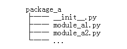

# 包

## 1.1 包的创建  就是一个包含多个py文件的组

为了组织好模块，会将多个模块分为包。Python 处理包也是相当方便的。简单来说，**包就是文件夹，但该文件夹下必须存在 `__init__.py `文件**（初始化文件）。

常见的包结构如下：



最简单的情况下，只需要一个空的 `__init__.py` 文件即可。当然它也可以执行包的初始化代码，或者定义稍后介绍的 `__all__ `变量。当然包底下也能包含包，这和文件夹一样，还是比较好理解的。

我们想手动创建一个包，只需进行以下 2 步操作：

1. 新建一个文件夹，文件夹的名称就是新建包的包名；
2. 在该文件夹中，创建一个 `__init__.py` 文件（前后各有 2 个下划线‘_’），该文件中可以不编写任何代码。当然，也可以编写一些 python初始化代码，则当有其它程序文件导入包时，会自动执行该文件中的代码（本节后续会有实例）。

例如，现在我们创建一个非常简单的包，该包的名称为 my_package，可以仿照以上 2 步进行：

1. 创建一个文件夹，其名称设置为 my_package；
2. 在该文件夹中添加一个 `__init__.py `文件，此文件中可以不编写任何代码。不过，这里向该文件编写如下代码：

```python
'''
创建第一个 Python 包
'''
print('大家好')
```

可以看到，`__init__.py` 文件中，包含了 2 部分信息，分别是此包的说明信息和一条 print 输出语句。

创建好包之后，我们就可以向包中添加模块（也可以添加包）。这里给 my_package 包添加 2 个模块，分别是 `module1.py`、`module2.py`，各自包含的代码分别如下所示：

```python
#module1.py模块文件
def p(s):
    print(s)
#module2.py 模块文件
class Student:
    def p(self):
        print("我是一个实例函数")
```

现在，我们就创建好了一个具有如下文件结构的包：

```
my_package
     ┠── __init__.py
     ┠── module1.py
     ┗━━  module2.py
```


## 1.2 Python包的导入

通过前面的学习我们知道，包其实本质上还是模块，因此导入模块的语法同样也适用于导入包。无论导入我们自定义的包，还是导入从他处下载的第三方包，导入方法可归结为以下 3 种：

1. `import 包名[.模块名 [as 别名]]`
2. `from 包名 import 模块名 [as 别名]`
3. `from 包名.模块名 import 成员名 [as 别名]`

用 [] 括起来的部分，是可选部分，即可以使用，也可以直接忽略。

> 注意，导入包的同时，会在包目录下生成一个含有`__init__.cpython-39.pyc  `文件的 `__pycache__ `文件夹。

在测试py文件中导入模块

```python
import my_package
#大家好
```

可见当直接导入指定包时，程序会自动执行该包所对应文件夹下的 `__init__.py `文件中的代码。

* **直接导入包名**，并不会将包中所有模块全部导入到程序中，它的作用仅仅是导入并执行包下的 `__init__.py` 文件，因此，运行该程序，在执行 `__init__.py `文件中代码的同时，还会抛出 AttributeError 异常（访问的对象不存在）：

以前面创建好的 my_package 包为例，导入 module1 模块并使用该模块中成员可以使用如下代码：

```python
import my_package.module1
my_package.module1.p("哈喽")
#大家好
#哈喽
```

同样可以使用

```
from my_package import module1
module1.p("哈喽")
from my_package.module1 import p
p("哈喽")
```

