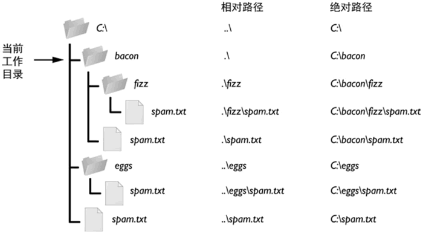

# 1 使用os.path操作文件与文件夹

os.path 模块主要用于获取文件的属性。

os.path中.表示当前目录，..表示上级目录

| 方法                                | 功能说明                                                     |
| ----------------------------------- | ------------------------------------------------------------ |
| os.path.abspath(path)               | 返回path规范化的绝对路径                                     |
| os.path.dirname(path)               | 返回path的目录。其实就是os.path.split(path)的第一个元素      |
| os.path.basename(path)              | 返回path最后的文件名。如果path以／或\结尾，那么就会返回空值。 |
| os.path.split(path)                 | 将path分割成目录和文件名二元组返回                           |
| os.path.splitext(path)              | 分割路径path，返回路径名和文件扩展名组成的元组               |
| os.path.splitdrive(path)            | 返回由驱动器名和路径组成的元组                               |
| os.path.join(path1[, path2[, ...]]) | 将多个路径组合后返回                                         |
| os.path.isfile(path)                | 如果path是一个存在的文件，返回True。否则返回False            |
| os.path.isdir(path)                 | 如果path是一个存在的目录，则返回True。否则返回False          |
| os.path.getctime(path)              | 返回path所指向的文件或者目录的创建时间                       |
| os.path.getmtime(path)              | 返回path所指向的文件或者目录的最后修改时间                   |
| os.path.getatime(path)              | 返回path所指向的文件或者目录的最后存取时间                   |
| os.path.getsize(filename)           | 返回文件包含的字符数量（字节）                               |

## 什么是绝对路径与相对路径

明确一个文件所在的路径，有 2 种表示方式，分别是：

- 绝对路径：总是从根文件夹开始，Window 系统中以盘符（C：、D：）作为根文件夹，而 OS X 或者 Linux 系统中以 / 作为根文件夹。
- 相对路径：指的是文件相对于当前工作目录所在的位置。例如，当前工作目录为 "C:\Windows\System32"，若文件 demo.txt 就位于这个 System32 文件夹下，则 demo.txt 的相对路径表示为 ".\demo.txt"（其中 .\ 就表示当前所在目录）。

在使用相对路径表示某文件所在的位置时，除了经常使用 .\ 表示当前所在目录之外，还会用到 ..\ 表示当前所在目录的父目录。

以图 为例，如果当前工作目录设置为 C:\bacon，则这些文件夹和文件的相对路径和绝对路径，就对应为该图右侧所示的样子。



### demo 1

os.path.abspath(path)返回path的规范化绝对路径

```python
import os
path = os.getcwd() #因为每台电脑的工作路径不同，因此我们练习时，先获取工作路径
print('当前工作路径为：',path) 
path = './文件名或者文件夹全称'
print(os.path.abspath(path))  #把path转成绝对路径
```

### demo 2

os.path.dirname(path)  返回path的目录。os.path.basename(path)  返回path最后的文件名

```python
import os
path = os.getcwd() #因为每台电脑的工作路径不同，因此我们练习时，先获取工作路径
print('当前工作路径为：',path)
path = './1.1.py'    #1.1.py改成自己文件中的一个文件名
path= os.path.abspath(path)  #把path转成绝对路径
print(path)                 #显示path的绝对路径
print(os.path.dirname(path))  #显示path的文件名目录部分
print(os.path.basename(path)) #显示path最后的文件名
#当前工作路径为： E:\科师\2021春资料\课程\python\ces
#E:\科师\2021春资料\课程\python\ces\1.1.py
#E:\科师\2021春资料\课程\python\ces
#1.1.py
```

### demo 3

os.path.split(path)  将路径path分割成目录和文件名的二元组返回

```python
import os
path = os.getcwd() #因为每台电脑的工作路径不同，因此我们练习时，先获取工作路径
print('当前工作路径为：',path)
path = './1.1.py'
path= os.path.abspath(path)  #把path转成绝对路径
print(path)                 #显示path的绝对路径
print(os.path.split(path))
#当前工作路径为： E:\科师\2021春资料\课程\python\ces
#E:\科师\2021春资料\课程\python\ces\1.1.py
#('E:\\科师\\2021春资料\\课程\\python\\ces', '1.1.py')
```

### demo 4

os.path.join(path1[, path2[, ...]])  将多个路径组合后返回  

```python
import os
path1 = os.getcwd() #因为每台电脑的工作路径不同，因此我们练习时，先获取工作路径
print('当前工作路径为：',path1)
path2 = '1.1.py'
path= os.path.join(path1,path2)  #把path1,path2拼接成的路径
print(path)                 #显示path的路径
#当前工作路径为： E:\科师\2021春资料\课程\python\ces
#E:\科师\2021春资料\课程\python\ces\1.1.py
```

### demo 5

os.path.getsize(path) 返回path路径下的文件大小（字节）

```python
import os
path1 = os.getcwd() #因为每台电脑的工作路径不同，因此我们练习时，先获取工作路径
print('当前工作路径为：',path1)
path2 = '1.1.py'
path= os.path.join(path1,path2)  #把path1,path2拼接成的路径
print(path)                 #显示path的路径
print(os.path.getsize(path))  #返回path路径下的文件大小（字节）
#当前工作路径为： E:\科师\2021春资料\课程\python\ces
#E:\科师\2021春资料\课程\python\ces\1.1.py
#394
```

### demo 6

os.path.splitext(path) 分割path路径，返回路径名和文件扩展名组成的元组

```python
import os
path1 = os.getcwd() #因为每台电脑的工作路径不同，因此我们练习时，先获取工作路径
print('当前工作路径为：',path1)
path2 = '1.1.py'
path= os.path.join(path1,path2)  #把path1,path2拼接成的路径
print(path)                 #显示path的路径
print(os.path.splitext(path))  #分割path路径，返回路径名和文件扩展名组成的元组
#当前工作路径为： E:\科师\2021春资料\课程\python\ces
#E:\科师\2021春资料\课程\python\ces\1.1.py
#('E:\\科师\\2021春资料\\课程\\python\\ces\\1.1', '.py')
```

### demo 7

os.path.splitdrive(path) 分割path路径，返回驱动器名和路径名组成的元组

```python
import os
path1 = os.getcwd() #因为每台电脑的工作路径不同，因此我们练习时，先获取工作路径
print('当前工作路径为：',path1)
path2 = '1.1.py'
path= os.path.join(path1,path2)  #把path1,path2拼接成的路径
print(path)                 #显示path的路径
print(os.path.splitdrive(path))  #分割path路径，返回驱动器名和路径名组成的元组
```