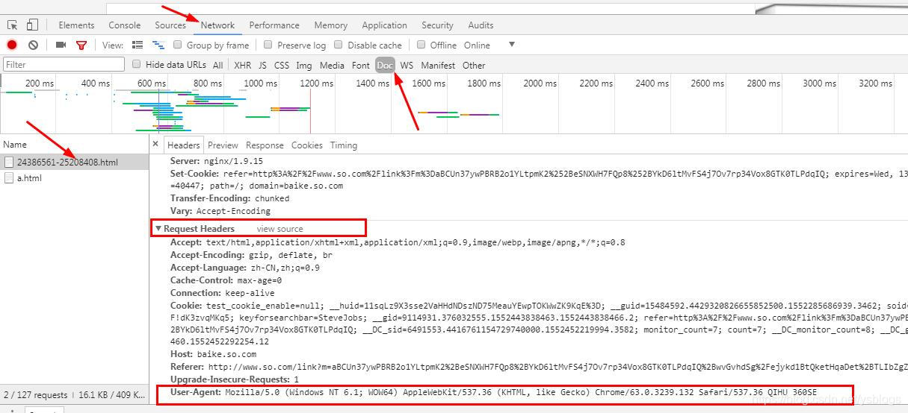

# Requests: 让 HTTP 服务人类

虽然Python的标准库中 urllib2 模块已经包含了平常我们使用的大多数功能，但是它的 API 使用起来让人感觉不太好，而 Requests 自称 “HTTP for Humans”，说明使用更简洁方便。

Requests 是使用 Apache2 Licensed 许可证的 基于Python开发的HTTP 库，其在Python内置模块的基础上进行了高度的封装，从而使得Pythoner进行网络请求时，变得美好了许多，使用Requests可以轻而易举的完成浏览器可有的任何操作。

## 安装方式

利用 pip 安装 或者利用 easy_install 都可以完成安装：

```python
pip install requests
#或者
pip install -i https://pypi.tuna.tsinghua.edu.cn/simple requests
```

# 1 为什么要设置headers? 

在请求网页爬取的时候，输出的text信息中会出现抱歉，无法访问等字眼，这就是禁止爬取，需要通过反爬机制去解决这个问题。

headers是解决requests请求反爬的方法之一，相当于我们进去这个网页的服务器本身，假装自己本身在爬取数据。

对反爬虫网页，可以设置一些headers信息，模拟成浏览器取访问网站 。

# 2  headers在哪里找？ 

谷歌或者火狐浏览器，在网页面上点击：右键–>检查–>剩余按照图中显示操作，需要按Fn+F5刷新出网页来 ,ctrl+R刷新

有的浏览器是点击：右键->查看元素，刷新


**注意：**headers中有很多内容，主要常用的就是user-agent 和 host，他们是以键对的形式展现出来，如果user-agent 以字典键对形式作为headers的内容，就可以反爬成功，就不需要其他键对；否则，需要加入headers下的更多键对形式。

# 基本GET请求（headers参数 和 parmas参数）

* 最基本的GET请求可以直接用get方法

```python
response = requests.get("http://www.baidu.com/")
 
# 也可以这么写
# response = requests.request("get", "http://www.baidu.com/")
```

* 添加 headers 和 查询参数

如果想添加 headers，可以传入`headers`参数来增加请求头中的headers信息。如果要将参数放在url中传递，可以利用 `params` 参数。

```python
import requests

kw = {'wd': '长城'}

headers = {
    "User-Agent": "Mozilla/5.0 (Windows NT 10.0; Win64; x64) AppleWebKit/537.36 (KHTML, like Gecko) Chrome/54.0.2840.99 Safari/537.36"}

# params 接收一个字典或者字符串的查询参数，字典类型自动转换为url编码，不需要urlencode()
response = requests.get("http://www.baidu.com/s?", params=kw, headers=headers)

# 查看响应内容，response.text 返回的是Unicode格式的数据
print(response.text)

# 查看响应内容，response.content返回的字节流数据
print(response.content)

# 查看完整url地址
print(response.url)

# 查看响应头部字符编码
print(response.encoding)

# 查看响应码
print(response.status_code)
```

## 3 代理（proxies参数）

如果需要使用代理，你可以通过为任意请求方法提供 `proxies` 参数来配置单个请求：

```python
import requests
 
# 根据协议类型，选择不同的代理
proxies = {
  "http": "http://12.34.56.79:9527",
  "https": "http://12.34.56.79:9527",
}
 
response = requests.get("http://www.baidu.com", proxies = proxies)
print(response.text)

```

```python
```

